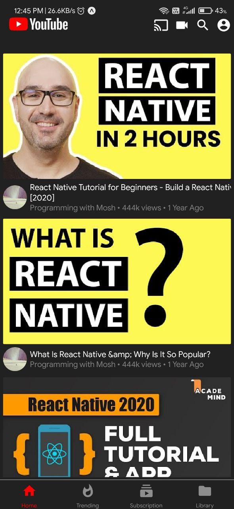
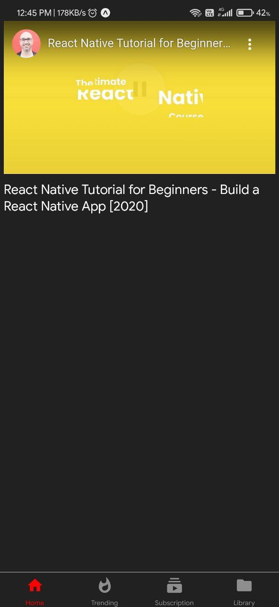
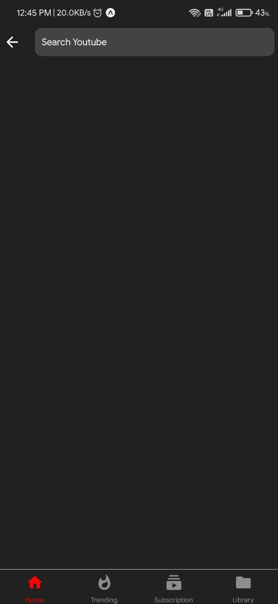
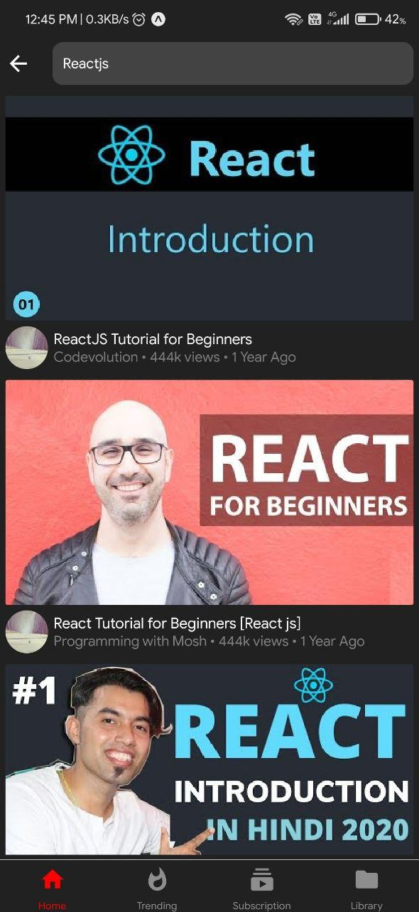

# Youtube Clone in React-Native 

## Features 
- Search Functionality
- Homepage [Currently It is Showing the results searech for "React Native]
- A normal player Page 
- Note:- Channel Art,View Count and Date are Hard Coded !

## Preview 📸

|       |        |
|------------|------------|
| | 

|       |        |
|------------|------------|
| | 

## Tools :wrench:

- [react-native-youtube-iframe
](https://www.npmjs.com/package/react-native-youtube-iframe)

### API
- Official [youtubeapi](https://developers.google.com/youtube/v3) 

## How to Run 🚀
- Clone the repo `git clone https://github.com/hrithik73/youtube-clone.git`
- Install the dependicies `npm install or yarn install`
- Run it `npm start or expo start`

